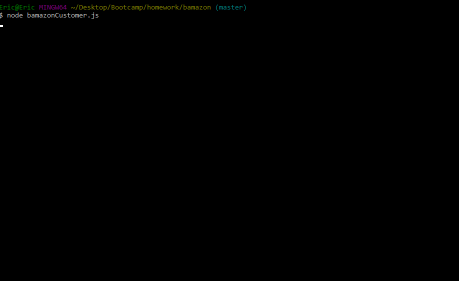

# bamazon

This app has two programs: a customer program and a manager program.  The customer program is for someone who wants to purchase an item from the store.  The manager program is for maintaining the inventory of items and adding new products to sell.

## How to install it
Here is how you get started:
```
git clone git@github.com:ewgalassi/bamazon.git
cd bamazon
npm init -y
npm install
```

Next you will need to setup your MySQL server and run the `schema.sql` file commands (that are not commented out).
Then, depending on which program you would like to run:
```
node bamazonCustomer.js
```
or
```
node bamazonManager.js
```

### How to use it
The prompts in the program will provide you with selections or ask for inputs.  Just make sure you use numbers where necessary or the program will ask you to try again.

## Example of using bamazonCustomer.js
<p align='center'>

</p>

## Example of using bamazonManager.js
<p align='center'>

</p>
